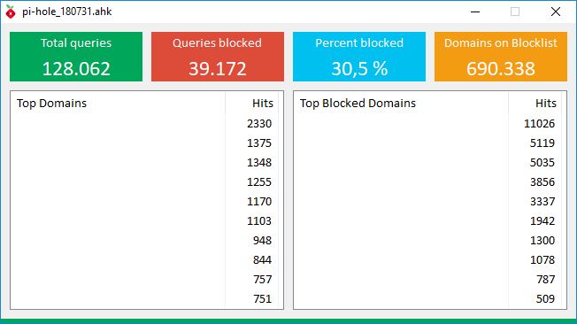

# AHK Pi-hole
An unofficial Pi-hole GUI written in AutoHotkey

## Features
* Displays 'Total queries', 'Queries blocked', 'Percent blocked' & 'Domains on Blocklist'
* Displays 'Top queries' & 'Top ads'
* Displays Status 'enabled' or 'disabled'

## Screenshots

## Contributing
* thanks 'Pi-hole Team' for his great work ([pi-hole.net](https://pi-hole.net/))
* thanks Bentschi for DownloadToString() & json()
* thanks SKAN for CreateGradient()
* thanks 'just me' for HideFocusBorder()

## Questions / Bugs / Issues
If you notice any kind of bugs or issues, report them on the [AHK Thread](https://autohotkey.com/boards/viewtopic.php?t=52981). Same for any kind of questions.

## Copyright and License
[MIT License](LICENSE)

## Donations (PayPal)
[Donations are appreciated if I could help you](https://www.paypal.me/smithz)